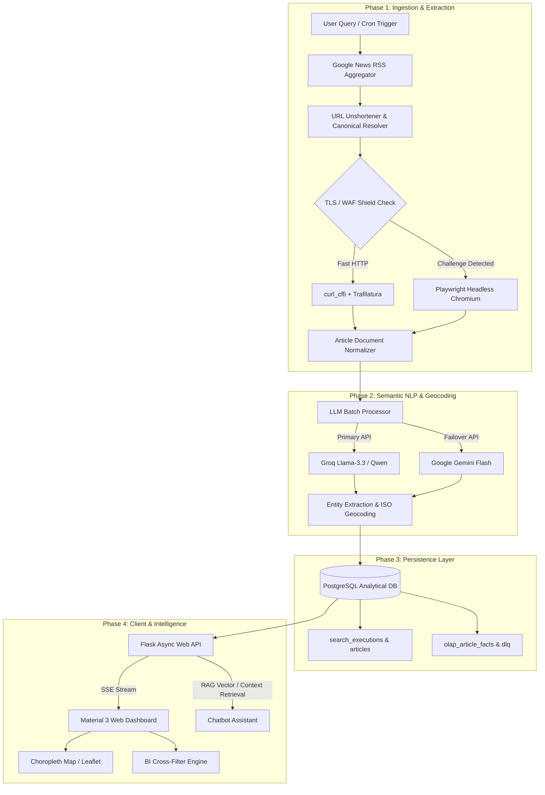

<div align="center">

  

  # AI News Explorer
  
  **Enterprise-grade, asynchronous news scraping, geographic intelligence & LLM-powered analytical platform.**

  [](https://www.python.org/)
  [](https://palletsprojects.com/p/flask/)
  [](https://www.postgresql.org/)
  [](https://dagster.io/)
  [](https://tailwindcss.com/)
  [](https://www.docker.com/)

  <br/>
  
  [](https://your-username.github.io/ai-news-explorer/)

  <p align="center">
    <a href="#-overview">Overview</a> •
    <a href="#-preview--screenshots">Screenshots</a> •
    <a href="#-key-features">Key Features</a> •
    <a href="#-architecture">Architecture</a> •
    <a href="#-quick-start">Quick Start</a> •
    <a href="#-tech-stack">Tech Stack</a> •
    <a href="#-project-structure">Project Structure</a>
  </p>

</div>

---

## 📌 Overview

**AI News Explorer** is an end-to-end data engineering and analytical solution designed to scrape, resolve, enrich, and visualize real-time geopolitical and macroeconomic news coverage. 

It combines **resilient web scraping** (bypassing dynamic WAFs and bot detection), **automated spatial NLP extraction** via LLMs (Groq & Gemini), a **high-throughput PostgreSQL analytical storage (OLAP/DLQ)**, and an **interactive Material 3 BI Dashboard** equipped with choropleth maps, cross-filtering, and an integrated RAG AI conversational assistant.

---

## 📸 Preview & Screenshots

<div align="center">

### 🌐 Main Feed & Interactive Dashboard
<!-- Place your screenshot at docs/img/dashboard_preview.png -->


<br/><br/>

### 🗺️ Choropleth Maps & Geo-Analytics
<!-- Place your screenshot at docs/img/map_analytics.png -->


<br/><br/>

### 💬 RAG Chatbot Assistant & Multi-Execution History
| AI Assistant (RAG Chat) | Execution History & Cross-Run Analytics |
|:---:|:---:|
| <!-- docs/img/chatbot.png -->  | <!-- docs/img/history.png -->  |

</div>

---

## ⚡ Key Features

- **🛡️ Anti-Bot & WAF Evasion**: Layered extraction engine with `curl_cffi` (impersonating browser TLS fingerprints), automatic URL un-shortening, Trafilatura heuristic body extraction, and headless **Playwright** as dynamic fallback.
- **📍 Automated Geographic NLP**: Extracts referenced countries and states dynamically using fast LLM inference (`Groq` / `Llama 3.3` / `Gemini Flash`) with JSON validation and automatic fallback redundancy.
- **🗺️ Reactive Spatial Mapping**: Dynamic Leaflet.js choropleth maps (US & Mexico geo-entities) powered by client-side spatial indexing and real-time frequency clustering.
- **📊 Business Intelligence Cross-Filtering**: Dimensional slicing across publishers, dates, geographic states, and temporal trends with instant client-side updates.
- **🤖 Context-Aware RAG Assistant**: Multi-model streaming chat (`Server-Sent Events`) that grounds user queries into the current session or aggregated multi-run database history.
- **🔄 Fault-Tolerant Pipelines**: Background job queuing with execution isolation, live timers, incremental database ingestion, and Dead Letter Queue (DLQ) support.
- **⚙️ Dagster Orchestrator**: Integrated with Dagster asset definitions for declarative data pipelines and scheduled synchronization runs.
- **🌍 Full Internationalization (i18n)**: Seamless English & Spanish UI localization with persistent language selection.

---

## 🏗 Architecture



---

## 🚀 Quick Start

### Prerequisites

- [Docker](https://docs.docker.com/get-docker/) & [Docker Compose](https://docs.docker.com/compose/) (v2.0+)
- An API Key for [Groq](https://console.groq.com/) or [Google Gemini](https://aistudio.google.com/)

### Installation & Run

1. **Clone the repository:**
   ```bash
   git clone https://github.com/your-username/ai-news-explorer.git
   cd ai-news-explorer
   ```

2. **Configure Environment Variables:**
   ```bash
   cp .env.template .env
   ```
   Edit `.env` and fill in your API credentials:
   ```env
   ENCRYPTION_KEY=your_fernet_key_here
   GROQ_API_KEY=your_groq_key_here
   GEMINI_API_KEY=your_gemini_key_here
   POSTGRES_USER=admin
   POSTGRES_PASSWORD=your_secure_password
   ```

3. **Launch with Docker Compose:**
   ```bash
   docker compose up --build -d
   ```

4. **Access the Services:**
   - 🌐 **Web Dashboard:** [http://localhost:5000](http://localhost:5000)
   - ⚙️ **Dagster Webserver:** [http://localhost:3000](http://localhost:3000)
   - 🗄️ **PostgreSQL Port:** `127.0.0.1:5433`

---

## 🛠 Tech Stack

| Layer | Technologies |
|---|---|
| **Backend & API** | Python 3.10, Flask 3.0, Flask-Compress, Flask-Talisman, AsyncIO |
| **Data Pipelines & ETL** | Dagster, Dagster-Postgres, Dagster-Webserver |
| **Web Scraping & WAF** | `curl_cffi`, Playwright (Chromium), Trafilatura, BeautifulSoup4 |
| **LLM & Reasoning** | Groq SDK (Llama 3.3 / Qwen), Google GenAI SDK (Gemini Flash), LLMLingua |
| **Database & Storage** | PostgreSQL 15, `asyncpg`, `psycopg2-binary`, SQLite (Internal progress store) |
| **Frontend UI** | TailwindCSS 3.4 (Standalone JIT), Leaflet.js, Chart.js, Marked.js, DOMPurify |
| **Security & Privacy** | Cryptography (Fernet symmetric encryption for chat histories & PII), Strict CSP |

---

## 📂 Project Structure

```text
ai-news-explorer/
├── agents.py                 # Asynchronous scraper & extraction agents
├── app.py                    # Flask application endpoints, SSE & middleware
├── chatbot.py                # RAG context synthesizer & LLM streaming generator
├── dagster_pipeline.py       # Pipeline orchestrator and asset triggers
├── docker-compose.yml        # Multi-container service definitions
├── Dockerfile                # Hardened non-root application container
├── requirements.txt          # Production-pinned Python dependencies
├── etl/
│   └── definitions.py        # Dagster asset declarations & schedules
├── sql/
│   ├── init_olap.sql         # Fact & dimension schema migrations
│   └── init_dlq.sql          # Dead letter queue definition
├── static/
│   ├── css/                  # Tailwind input & compiled minified output
│   ├── img/                  # Visual assets & SVG favicon
│   ├── js/                   # Modular client UI, API, maps & i18n logic
│   └── maps/                 # Topo/GeoJSON boundary definitions (US, MX)
├── templates/
│   ├── components/           # Jinja2 layout partials (header, tabs, progress)
│   ├── views/                # Modular view templates (feed, analytics, history, docs)
│   └── index.html            # Main single-page application shell
├── utils/                    # OLAP handlers, LLM batching, security & queues
└── docs/
    └── img/                  # Documentation images & preview screenshots
```

---

## 🧪 Testing

Run asynchronous unit and integration tests inside the environment:

```bash
# Run tests directly with pytest
pytest tests/ -v
```

---

<div align="center">
  <sub>Happy scraping!</sub>
</div>